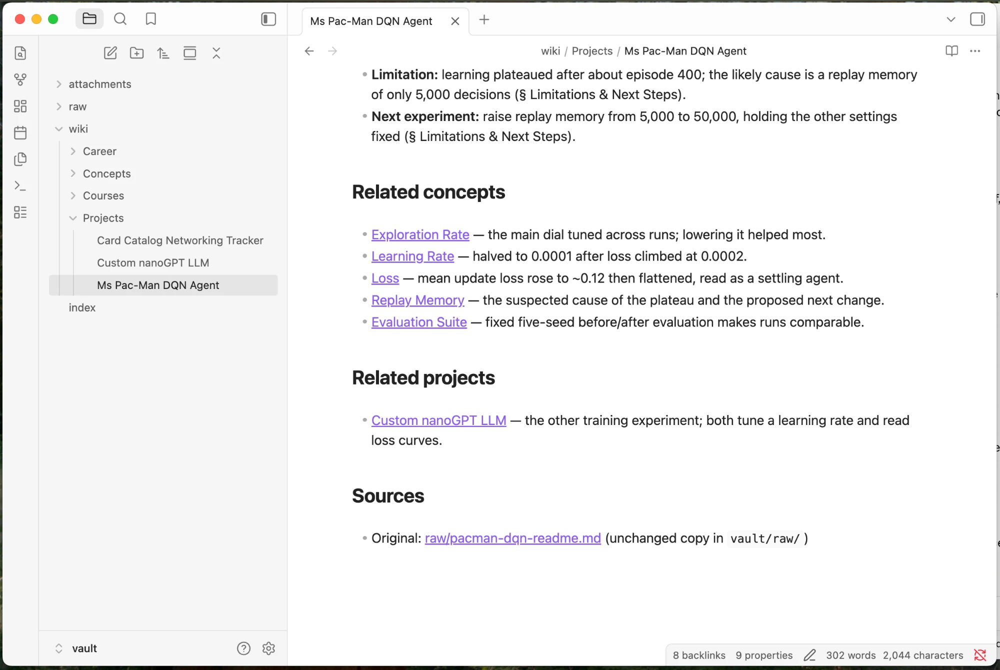
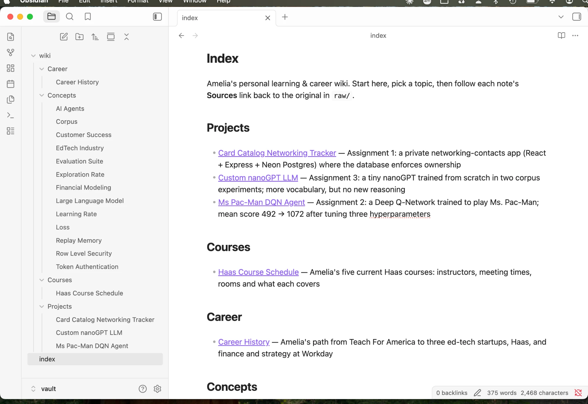
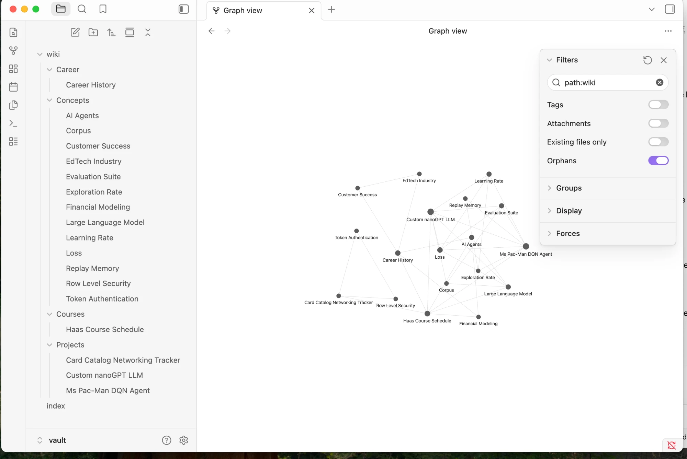
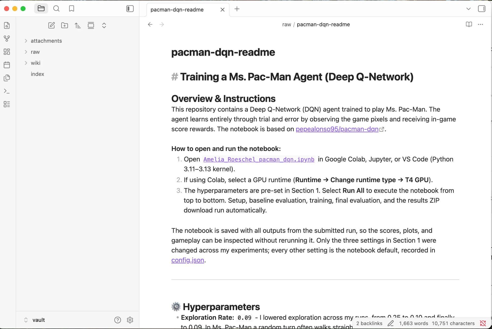

# Personal Wiki: Local Gemma + RAG

**Class 5 · Assignment 4 · Amelia Roeschel**

This is a command-line personal wiki that runs **fully offline** on my MacBook Air (M1, 8 GB). It turns my notes into a linked Obsidian vault. A local **Gemma 4 E2B** model answers questions from that vault in three modes: **chat** (a personal assistant), **ask** (cited factual answers) and **search** (raw passages only). The CLI and harness are my own code, about 900 lines of Python in [`wikicli/`](wikicli/). The only libraries are the MLX inference runtime and the Python standard library.

| Start here | |
|---|---|
| Evaluation: 4 ask tests, mode checks, 7 failures and their fixes | [`evidence/EVALUATION.md`](evidence/EVALUATION.md) |
| Final offline run (full terminal log) | [`evidence/offline/offline-demo-20260929-150746.log`](evidence/offline/offline-demo-20260929-150746.log) |
| The wiki (open `vault/` in Obsidian) | [`vault/index.md`](vault/index.md) |
| CLI and harness code | [`wikicli/`](wikicli/) · launcher [`wiki`](wiki) |
| Instructions the harness loads | [`prompts/persona.md`](prompts/persona.md) (chat) · [`prompts/wiki-instructions.md`](prompts/wiki-instructions.md) (ask) · [`prompts/ingest-instructions.md`](prompts/ingest-instructions.md) (ingest) |
| Test questions and expected evidence (answer key, outside the vault) | [`tests/questions.md`](tests/questions.md) |

---

## 1. Purpose and sources

This wiki is my **learning and career memory**: what I built in this class, what I'm taking at Haas, and where my career has been. I wanted something I could ask "when does Conflict Lab meet?" or "what learning rate did I use for Pac-Man?" and get an answer with a citation I can check.

| Original (unchanged, `vault/raw/`) | What it is | Reviewed wiki note |
|---|---|---|
| [`networking-tracker-readme.md`](vault/raw/networking-tracker-readme.md) | My Assignment 1 README | [Card Catalog Networking Tracker](vault/wiki/Projects/Card%20Catalog%20Networking%20Tracker.md) |
| [`pacman-dqn-readme.md`](vault/raw/pacman-dqn-readme.md) | My Assignment 2 README | [Ms Pac-Man DQN Agent](vault/wiki/Projects/Ms%20Pac-Man%20DQN%20Agent.md) |
| [`custom-llm-readme.md`](vault/raw/custom-llm-readme.md) | My Assignment 3 README | [Custom nanoGPT LLM](vault/wiki/Projects/Custom%20nanoGPT%20LLM.md) |
| [`haas-courses-voice-note.md`](vault/raw/haas-courses-voice-note.md) | Dictated note on my 5 current courses, plus a short typed addendum | [Haas Course Schedule](vault/wiki/Courses/Haas%20Course%20Schedule.md) |
| [`career-history-voice-note.md`](vault/raw/career-history-voice-note.md) | Dictated career history, lightly edited by me for privacy before saving | [Career History](vault/wiki/Career/Career%20History.md) |

Ingestion also created **13 concept notes** in `wiki/Concepts/`, such as Learning Rate, Row Level Security and AI Agents, which link the source notes wherever they share an idea. All material is my own writing and is shareable. I kept confidential client work out.

**How originals connect to pages.** Each wiki note's frontmatter records `source_id`, `source_path` and `source_sha256`. It ends with a `## Sources` link to the raw file, and its key-detail bullets name the source section they came from (e.g. "(§ Hyperparameters)"). [`data/source_catalog.json`](data/source_catalog.json) maps every source ID to its note path, current title, Gemma's original title and a content hash.

## 2. Setup and device

| | |
|---|---|
| Computer | MacBook Air, **Apple M1**, **8 GB unified memory** (CPU and GPU share it; no discrete GPU or VRAM) |
| OS | macOS 15.5 (24F74) |
| Free memory / disk at test time | ~65% of RAM free at rest (`memory_pressure`); 35 GB free disk |
| Runtime | **MLX** via `mlx-vlm 0.7.2` (mlx 0.32.2, transformers 5.17.0), Python 3.14.7 |
| Model | [`mlx-community/gemma-4-e2b-it-4bit`](https://huggingface.co/mlx-community/gemma-4-e2b-it-4bit), revision `238767527555cb75a05732a84dff5d6ba0dd6809`. This is an MLX conversion of Google's [`google/gemma-4-E2B-it`](https://huggingface.co/google/gemma-4-E2B-it) (Gemma license) |
| Quantization | 4-bit affine, group size 64. **3.3 GB** on disk |
| Retrieval | BM25 keyword search written in pure Python. No embedding model, nothing extra to download |

**Why E2B at 4-bit.** Google's guidance puts E2B at about 2.9 GB and E4B at about 4.5 GB to load at 4-bit. My Mac has 8 GB shared by the OS, the GPU and every open app. In practice E2B peaks at **4.65 GB** for a whole ask, which leaves room for Obsidian and a browser. E4B would push the machine into swapping, and 26B MoE (~14 GB) cannot fit. E2B is also fast enough to use (below). Its weakness is summary quality, which I handle with human review (see §5).

### Measured on my device (final offline run)

| Operation | Time | Memory |
|---|---|---|
| Ingest one source (Gemma writes a note) | 10–17 s per source; 45 s for the first 3 sources | 4.3 GB peak (MLX) |
| `ask`, end to end (new process: load model, retrieve, generate) | **6.9 s** wall clock, of which **2.2 s** is generation (4.0 s for the two-source question) | **4.65 GB** peak memory footprint, 2.0 GB resident (`/usr/bin/time -l`) |
| `search` (no model) | < 0.2 s | negligible |

### Install (online, once)

```bash
python3 -m venv ~/local-ai/venv
~/local-ai/venv/bin/pip install mlx-vlm==0.7.2
~/local-ai/venv/bin/hf download mlx-community/gemma-4-e2b-it-4bit --revision 238767527555cb75a05732a84dff5d6ba0dd6809
git clone https://github.com/ameliaroeschel-prog/personal-wiki.git && cd personal-wiki
./wiki --help
```

The weights go into the standard Hugging Face cache (`~/.cache/huggingface/hub`); they're not in this repo. After this, nothing needs the internet. [`wikicli/llm.py`](wikicli/llm.py) sets `HF_HUB_OFFLINE=1`, so the harness can never download at run time.

### Commands

```bash
./wiki help                                   # commands, config, required inputs
./wiki ingest vault/raw                       # Gemma writes notes for new sources; rebuilds index.md + search index
./wiki ingest vault/raw/pacman-dqn-readme.md --draft   # Gemma drafts to data/drafts/ without touching reviewed notes
./wiki search "replay memory plateau"         # original passages + paths, no model
./wiki ask "When does Conflict Lab meet?" --mode local   # cited answer or INSUFFICIENT EVIDENCE
./wiki chat                                   # Scout, the assistant: /notes <q>, /clear, /exit
./wiki check                                  # every [[link]] resolves; headings match filenames
./wiki reindex                                # rebuild index.md + search index, no model
./scripts/offline-demo.sh                     # the full offline demonstration (refuses to run if online)
```

Errors are explicit. A missing folder gives `Error: Source not found: …`. A missing index says "Run ./wiki ingest vault/raw". An unavailable model gives `Local model unavailable: …` along with the download command.

## 3. Architecture

```
                 ┌──────────────── CLI  (wikicli/cli.py) ────────────────┐
  ./wiki <cmd> → │ parses the command, picks the mode, prints and saves  │
                 └──┬──────────┬────────────┬─────────────┬──────────────┘
                    │ingest    │search      │ask          │chat
                    ▼          ▼            ▼             ▼
  HARNESS    ingest.py    retrieve.py    ask.py        chat.py
  (my code)  source→Gemma  BM25 only     RAG workflow   persona + history
             →note+links   (no model)    (standalone)   + retrieval router
             →index.md          ▲            │   ▲          │   ▲
                    │           └────────────┼───┴──────────┘   │
                    │        RETRIEVAL TOOL  │  (called by ask always,
                    │        data/chunks.json│   by chat only when useful)
                    ▼                        ▼
             MODEL: llm.py → local Gemma 4 E2B (MLX), the only file that calls the model
                    │
                    ▼
             evidence.py → evidence/<mode>/*.md + .json   (every run saved)
```

- **Model:** Gemma only turns the messages it's given into text. It does not read files, remember past runs or search anything on its own. [`llm.py`](wikicli/llm.py) loads it once per process and is the only place it's called.
- **Retrieval tool:** [`retrieve.py`](wikicli/retrieve.py) scores passages from `vault/raw/` and `vault/wiki/` with BM25. BM25 ranks a passage higher when it contains the query's rarer words. It returns each passage with its path, section and score. Search mode shows exactly this output.
- **RAG workflow:** [`ask.py`](wikicli/ask.py) runs retrieve → put passages and research rules into a prompt → Gemma → check citations. RAG gives the model evidence at answer time; it doesn't train it.
- **Harness:** everything in `wikicli/`. It chooses the mode, loads the right instruction file, manages conversation history, decides when chat retrieves, builds prompts, calls Gemma, checks citations, handles errors and saves outputs.
- **CLI:** [`cli.py`](wikicli/cli.py) plus the [`wiki`](wiki) launcher, which runs the package with the MLX virtual environment.

### One command traced end to end: `./wiki ask "What exploration rate did I use in my final Pac-Man run?"`

1. **`wiki`** runs `python -m wikicli ask …`, and **`cli.main()`** parses `ask` and joins the question words.
2. **`ask.run()`** calls **`retrieve.search(question, k=4)`**. It tokenizes the question (lowercase, drop stopwords, light stemming), scores all 129 passages in `data/chunks.json` with BM25, and returns the top 4. Here rank 1 is `raw/pacman-dqn-readme.md › ⚙️ Hyperparameters` (score 12.9).
3. If the top score were below `MIN_SCORE = 2.0`, ask would answer INSUFFICIENT EVIDENCE **without calling the model**. Here it isn't, so passages are labeled `[S1]…[S4]`.
4. **`ask.build_messages()`** makes a system message from [`prompts/wiki-instructions.md`](prompts/wiki-instructions.md) (use only the passages, cite `[S#]`, otherwise say INSUFFICIENT EVIDENCE, neutral voice) and a user message with the 4 labeled passages plus the question. That's about 1,100 tokens in total. There is **no chat history and no persona**.
5. **`llm.generate()`** applies Gemma's chat template and generates locally (temperature 0.1, max 350 tokens): *"…0.09 [S3]."*
6. **`ask.check_citations()`** extracts `[S3]` and confirms it's one of the retrieved passages. It returns a verdict: no citations, or citations to passages that weren't retrieved, count as a FAIL.
7. **`evidence.save()`** writes `evidence/ask/<time>-<question>.md` and `.json` (question, every passage and path, model, mode, answer, citation verdict, timing, memory). **`cli.py`** prints the passages, the answer, the verdict, the time and the card path.

### How chat decides whether to retrieve

[`chat.decide_retrieval()`](wikicli/chat.py) uses plain rules, so every decision can be audited. The reason is printed after each reply:
1. `/notes <q>` forces a lookup.
2. Small talk, questions about the assistant, and edits to the last reply ("make that shorter") never retrieve.
3. Messages about my notes or projects ("my project", "did I", "Pac-Man", "wiki"…) retrieve.
4. Drafting requests ("draft…", "plan…") without such a mention don't retrieve.
5. Anything else retrieves only on a very strong BM25 match (score ≥ 8).

Retrieved passages go into that one turn's message. **History stores only what was said, not the passages**, because chat history is conversation, not verified evidence. Chat keeps the last 6 messages. Any `[S#]` that doesn't match a passage retrieved that turn is removed by `strip_invalid_citations()`, and the removal is reported.

## 4. Design choices

- **Passages:** Markdown is split at headings, and any section longer than 900 characters is split at blank lines. Sections under 200 characters merge into the previous one. A wiki note's "Related…" and "Sources" link lists are **not** indexed: they're navigation, and they outranked real evidence (failure 3). Each passage keeps its path and heading trail, e.g. `Training a Ms. Pac-Man Agent > ⚙️ Hyperparameters`.
- **Context limits:** ask sends the 4 top passages (≤ ~3,600 characters, about 1,100 tokens) and never the whole wiki. Gemma's window is much larger, but short prompts keep answers fast and memory low. Ingest sends at most **6,000 characters** per source. Longer sources are condensed to every heading plus the start of each section, so a 30 KB README fits in one call.
- **Research rules vs personality:** kept in separate files and loaded by separate modes. Ask loads only `wiki-instructions.md` (neutral voice, cite or refuse). Chat loads only `persona.md` ("Scout": warm, concise, an accurate list of what it can and can't do, suggestions labeled as suggestions).
- **Model settings:** temperature 0.1 for ask (factual), 0.2 for ingest, 0.6 for chat (more natural). Max tokens: 350 / 700 / 400.
- **Naming and folders:** notes are named for their subject in 2–6 words (e.g. `Ms Pac-Man DQN Agent.md`), with a first heading that matches the filename. `./wiki check` enforces this. There are four topic folders: `Projects/`, `Courses/`, `Career/`, `Concepts/`. Machine IDs (source ID, hash, Gemma's original title) live only in frontmatter and in `data/source_catalog.json`. Chunks, the catalog, drafts, logs and evidence are all **outside the vault**.
- **Re-ingestion without duplicates:** the catalog pins each source to one note path on first ingest. Re-ingesting overwrites that same file and never creates a new one. Notes I've reviewed carry `reviewed: true`, and ingest skips them unless `--force` (it warns if the source changed). `--draft` lets Gemma re-read a source and write to `data/drafts/` so I can compare, without touching the vault. Verified: re-ingesting all 6 sources leaves the file list identical (`./wiki ingest vault/raw` → five `skip … (reviewed, unchanged)` lines in the offline log).
- **Human review is part of the pipeline.** Gemma writes the first draft of every note; I checked each against its original and corrected it. Each note's `review_notes` field says what changed, and Gemma's drafts are kept in [`evidence/ingest/`](evidence/ingest/).

## 5. Evidence

All of this was run with the model and data described above. Full write-up: **[`evidence/EVALUATION.md`](evidence/EVALUATION.md)**.

**Four ask tests (offline):** all pass. Each evidence card shows the retrieved passages with paths, the actual answer and the citation check.
[Test 1: direct](evidence/ask/20260929-150812-what-exploration-rate-did-i-use-in-my-fi.md) ·
[Test 2: paraphrase](evidence/ask/20260929-150819-how-much-bigger-did-the-word-list-get-wh.md) ·
[Test 3: two sources](evidence/ask/20260929-150828-which-of-my-projects-ran-on-google-colab.md) ·
[Test 4: unanswerable](evidence/ask/20260929-150904-what-grade-did-i-receive-on-the-pac-man-.md)

**Chat and search mode checks (offline):** [transcript](evidence/chat/20260929-150857-chat-session.md). Capabilities question with no lookup; a draft labeled as a suggestion; "make that shorter" using the conversation; a claim made only in chat ("I got an A") that ask still reports as INSUFFICIENT EVIDENCE; raw search with no answer.

**Offline demonstration:** [`scripts/offline-demo.sh`](scripts/offline-demo.sh) first proves the internet is unreachable (`curl: (6) Could not resolve host: huggingface.co`) and refuses to run otherwise. It then runs help, ingest, a Gemma draft ingest, the link check, all four asks, chat and search, each as a fresh CLI process.
- Final run: [log](evidence/offline/offline-demo-20260929-150746.log) · [screenshot with Wi-Fi off](evidence/screenshots/07-final-offline-run-terminal.webp)
- Earlier runs, kept to show what failed: [first offline run](evidence/offline/offline-demo-20260929-145831.log) · [chat re-check](evidence/offline/offline-demo-chat-recheck-20260929-150420.log)

**Obsidian** (vault opened at `vault/`; graph filter `path:wiki`, Attachments off, Orphans on):

| An open note: filename = heading, related-concept links, source reference | Page list and topic-grouped index |
|---|---|
|  |  |
| **Graph of the 18 curated notes** | **Following the Sources link to the unchanged original (2 backlinks)** |
|  |  |

Trace: index → *Ms Pac-Man DQN Agent* → *Learning Rate* (the related concept, which links back to both training projects) → `raw/pacman-dqn-readme.md` via the Sources link. `./wiki check` reports "All links resolve; all 18 note headings match filenames."

## 6. Reflection: a limitation and an improvement

**Limitation: keyword retrieval only matches words, not meaning.** It showed up in two ways:
- **Test 2** ("word list" vs the source's "vocabulary"): the right passage came in only at rank 2, below an unrelated one. It was found at all only because "food files" happened to match.
- **Failure 6**, the reverse: "draft a study plan for my **final exams**" matched my nanoGPT **eval** notes strongly enough that chat pulled them in and built a study plan from them.

I patched the chat side with a rule. But rules don't generalize: each new note shifts the BM25 scores, which is exactly why the same prompt behaved differently on 09-27 and 09-29.

A second, related limitation is the 2B model's summaries. In one note it covered 1 of 5 courses, it dropped dates, and it once misreported an accuracy figure. Every note needed human review. Ask stays accurate because answers come from retrieved text, not from the model's memory of the note.

**Improvement I would try: hybrid retrieval with a small local embedding model.** For example EmbeddingGemma (~300M parameters, well under 1 GB), downloaded once and run offline. I would score each passage by BM25 plus embedding similarity, and use the embedding score (meaning-based) to decide whether chat should retrieve. To test it: rerun the same four questions, add five more paraphrased questions to `tests/questions.md`, and compare the expected passage's rank, plus how often chat retrieves when it shouldn't. I'd also check that peak memory stays under about 5.5 GB alongside Gemma.

## 7. Online mode

Not implemented. Local is the only mode (`--mode local`), and everything above runs with no network.

## Repository layout

```
wiki                  launcher (uses ~/local-ai/venv)
wikicli/              harness: cli, config, llm, chunker, retrieve, ingest, ask, chat, evidence
prompts/              persona.md (chat) · wiki-instructions.md (ask) · ingest-instructions.md
vault/                ← the Obsidian vault
  raw/                unchanged originals
  wiki/               Projects/ Courses/ Career/ Concepts/ (reviewed notes)
  index.md            human landing page
data/                 chunks.json (search index), source_catalog.json, drafts/ (outside the vault)
tests/questions.md    the 4 test questions + expected evidence (outside the vault)
evidence/             EVALUATION.md, ask/ chat/ search/ cards, offline/ logs, ingest/ drafts, screenshots/
scripts/              offline-demo.sh
```
